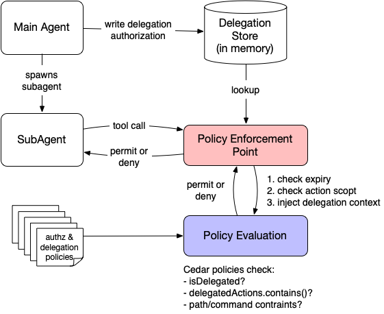

# Cedar Delegation-as-Data Demo for OpenClaw

**Advanced Feature:** This demo extends the previous two demos with **delegation-as-data** — the main agent can explicitly grant a subset of its permissions to a subagent, and Cedar policies enforce those narrower boundaries.

> Start with the basics first! Complete the [reactive authorization demo](README.md) and [query constraints demo](README-query-constraints.md) before exploring this.

## What This Demo Adds

The previous demos treat the main agent as a single principal:

- **Reactive** (Demo 1): Agent tries, gets denied, adapts
- **Proactive** (Demo 2): Agent queries constraints before acting

This demo adds a third dimension — **delegation**:

```
Main Agent → Create delegation (read-only, /tmp/*) → Spawn SubAgent → SubAgent acts within bounds
```

A subagent spawned with "only read files in /tmp" cannot escape that constraint even if it tries.

## How It Works

### Delegation Flow

1. **Main agent** calls `delegate_authorization` to create a delegation record specifying what the subagent can do (allowed actions, path/command patterns, optional TTL)
2. **Main agent** spawns subagent via `sessions_spawn`
3. **SubAgent** attempts tool calls — the PEP intercepts each one:
   - Looks up the delegation record by subagent session key
   - Checks TTL expiry (PEP-enforced — Cedar has no `now()`)
   - Checks if the action is in the delegation's allowed list
   - Injects delegation context into the Cedar PDP request
   - Uses `SubAgent` principal type instead of `Agent`
4. **Cedar PDP** evaluates delegation-aware policies that check `context.isDelegated`, `context.delegatedActions`, path/command constraints

### Delegation Is Prompt-Guided, Not Structurally Enforced

The main agent is told via system prompt to call `delegate_authorization` before spawning a subagent. This is guidance, not a hard gate — `sessions_spawn` does not require a delegation record to exist.

This is safe because the enforcement is on the **subagent side**, not the spawn side. If the main agent forgets (or chooses not) to delegate:

1. The subagent spawns normally
2. The subagent attempts a tool call
3. The PEP finds no delegation record for that session key
4. The request is **denied immediately** (policy `delegation-4-deny-undelegated-subagents`)
5. The subagent (and main agent) learn reactively from the denial

In other words, the worst case for a missing delegation is that the subagent can't do anything — not that it can do too much. The default is deny-all for subagents without delegations, which is the secure default.

### Why Prompt-Guided Instead of Built Into Code

A production system could hard-wire delegation into `sessions_spawn` — refuse to spawn without a delegation record, or auto-generate one. We deliberately chose prompt guidance for this demo for three reasons:

1. **It demonstrates the authorization pattern, not a product feature.** The point of this demo is to show how Cedar policies can enforce delegation boundaries. Coupling delegation to the spawn API would obscure that — it would look like an application-level feature rather than a policy-level pattern. Keeping them separate makes the authorization layer visible and understandable.

2. **It mirrors how the other demos work.** The reactive demo (demo 1) doesn't prevent the agent from attempting denied operations — it lets it try and learn. The proactive demo (demo 2) adds prompt guidance to query constraints first. This demo follows the same progression: prompt guidance to delegate first, with policy enforcement as the backstop. The consistency makes the three demos a coherent series.

3. **The agent choosing to delegate is part of the story.** In a real multi-agent system, the main agent decides *what* to delegate based on the task at hand. A read-only subagent for data analysis gets different permissions than a git-only subagent for code review. That decision is inherently an LLM reasoning step, not something you'd want to hard-code. The prompt guidance gives the agent the tool and the nudge; the policy layer ensures the boundaries hold regardless.

### Why the PEP Enforces Expiry

Cedar has no built-in clock or `now()` function. Time-based expiry (TTL) cannot be expressed as a Cedar policy condition. Instead:

- The delegation record stores an `expiresAt` timestamp
- The PEP checks this **before** calling Cedar
- Expired delegations are rejected immediately — the PDP never sees the request
- This keeps the trusted code boundary small (PEP only) while Cedar handles the structural authorization

### Architecture



## Prerequisites

1. **Completed previous demos** — reactive and query constraints
2. **Cedar PDP server** with delegation policies loaded (automatic when `policies-delegation.cedar` exists)

## Quick Start

### Step 1: Start PDP Server

```bash
python3 demo/cedar-pdp-server.py
```

The server auto-detects `policies-delegation.cedar` and loads it alongside the base policies. You should see:

```
Delegation: policies/cedar/policies-delegation.cedar
```

### Step 2: Run Delegation Tests

```bash
python3 demo/test-delegation.py
```

Expected output:

```
======================================================================
Cedar Delegation-as-Data Authorization Tests
======================================================================

Test: SubAgent delegated read: allow Read /tmp/data.txt
  Decision: Allow (expected Allow)
  Policies: delegation-1-allow-delegated-actions, policy-1-allow-readonly
  ✓ PASS

Test: SubAgent delegated read: deny Write (not in delegatedActions)
  Decision: Deny (expected Deny)
  Policies: delegation-4-deny-undelegated-subagents
  ✓ PASS

Test: SubAgent without delegation: deny Read
  Decision: Deny (expected Deny)
  Policies: delegation-4-deny-undelegated-subagents
  ✓ PASS

Test: Main Agent: allow Read (unaffected by delegation policies)
  Decision: Allow (expected Allow)
  Policies: policy-1-allow-readonly
  ✓ PASS

...

======================================================================
Results: 10 passed, 0 failed
======================================================================
```

### Step 3: Interactive Notebook Demo

The Jupyter notebook walks through each delegation scenario interactively:

```bash
jupyter notebook demo/delegation-demo.ipynb
```

The notebook simulates the PEP's behavior by constructing the same Cedar authorization requests the PEP would build — with and without delegation context — and shows the results step by step. It covers:

1. Main agent with full access (baseline)
2. SubAgent without delegation (denied everything)
3. Creating a read-only `/tmp/*` delegation
4. SubAgent operating within and outside delegation scope
5. Git-only delegation pattern
6. PEP-enforced expiry (simulated — Cedar can't check time)

### Why the Notebook Instead of a Live Agent Test

Testing the full delegation flow end-to-end requires the OpenClaw gateway running with `sessions_spawn` actually creating subagent sessions. That's a much heavier setup than this demo repo provides.

The notebook and test script demonstrate the same Cedar policy evaluation that happens in production — they construct the exact authorization requests the PEP sends to the PDP. The only thing they don't exercise is the in-process PEP logic (delegation store lookup, expiry check, context injection), which is straightforward TypeScript that the notebook explains and simulates.

For a full end-to-end test with a live agent:

```bash
pnpm openclaw agent --agent main --message \
  "Spawn a subagent that can only read files in /tmp. \
   Delegate read-only access, then have it list what's there."
```

This requires the full OpenClaw runtime (gateway, agent runner, PDP server all running).

### Step 4: Verify Previous Demos Still Work

```bash
python3 demo/test-pdp.py
python3 demo/test-query-constraints.py
```

All existing tests should pass unchanged.

## Cedar Policies

Delegation policies live in `policies/cedar/policies-delegation.cedar` (separate from base policies):

| Policy ID | Type | Purpose |
|-----------|------|---------|
| `delegation-1-allow-delegated-actions` | permit | Allow SubAgent actions that are in `delegatedActions` set |
| `delegation-2-enforce-path-constraint` | forbid | Deny file ops outside `delegatedPathPattern` |
| `delegation-3-enforce-command-constraint` | forbid | Deny bash/exec outside `delegatedCommandPattern` |
| `delegation-4-deny-undelegated-subagents` | forbid | Deny all SubAgent actions without a valid delegation |
| `delegation-5-deny-out-of-scope-actions` | forbid | Deny SubAgent actions not listed in `delegatedActions` (overrides base permits) |

These policies only match `principal is OpenClaw::SubAgent` — main `Agent` principals are unaffected.

## Example Scenarios

### Read-Only SubAgent

```
delegate_authorization({
  subagentSessionKey: "agent:main:subagent:reader-1",
  allowedActions: ["read", "glob", "grep"],
  pathPattern: "/tmp/*"
})
```

- Can: Read, Glob, Grep files under `/tmp/`
- Cannot: Write, Edit, Bash, or read outside `/tmp/`

### Git-Only SubAgent

```
delegate_authorization({
  subagentSessionKey: "agent:main:subagent:git-worker",
  allowedActions: ["bash"],
  commandPattern: "git *"
})
```

- Can: Run `git status`, `git log`, `git diff`, etc.
- Cannot: Run `rm -rf`, `curl | sh`, or any non-git command

### Time-Limited Delegation

```
delegate_authorization({
  subagentSessionKey: "agent:main:subagent:temp-1",
  allowedActions: ["read", "write"],
  pathPattern: "/tmp/*",
  ttlSeconds: 300  // 5 minutes
})
```

- Can: Read/write under `/tmp/` for 5 minutes
- After 5 minutes: PEP rejects immediately (no PDP call)

## Comparison

| Aspect | No Delegation | Delegation-as-Data |
|--------|--------------|-------------------|
| **SubAgent permissions** | Same as main agent | Explicitly scoped subset |
| **Escape boundaries** | SubAgent can do anything agent can | SubAgent is confined to delegation |
| **Time limits** | None | PEP-enforced TTL |
| **Path restrictions** | Global policies only | Per-delegation path patterns |
| **Command restrictions** | Global policies only | Per-delegation command patterns |
| **Audit trail** | Agent principal only | Distinct SubAgent principal + delegation ID |

## Implementation Details

### New Files

| File | Purpose |
|------|---------|
| `policies/cedar/policies-delegation.cedar` | Delegation-aware Cedar policies |
| `src/authz/delegation-store.ts` | In-memory delegation record store |
| `src/agents/tools/delegate-authz-tool.ts` | `delegate_authorization` tool |
| `demo/test-delegation.py` | Test script |

### Modified Files

| File | Change |
|------|--------|
| `policies/cedar/schema.cedarschema` | Added `SubAgent` entity, delegation context attributes |
| `policies/cedar/entities.json` | Added sample `SubAgent` entities |
| `src/authz/cedar-pdp-client.ts` | `SubAgent` principal support, delegation context merging |
| `src/agents/pi-tools.before-tool-call.ts` | PEP delegation checks (expiry, scope, context injection) |
| `src/agents/openclaw-tools.ts` | Register `delegate_authorization` tool |
| `demo/cedar-pdp-server.py` | Load delegation policies alongside base policies |

## Resources

- [Basic Authorization Demo](README.md) — reactive authorization
- [Query Constraints Demo](README-query-constraints.md) — proactive TPE queries
- [Cedar Policy Language](https://docs.cedarpolicy.com/) — official docs
- [Cedar Entity Types](https://docs.cedarpolicy.com/schema/schema.html) — entity hierarchy (`in` keyword)
