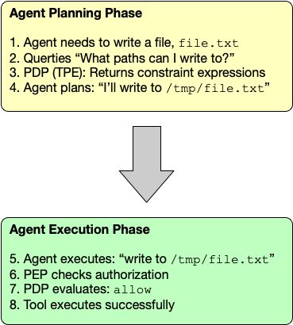
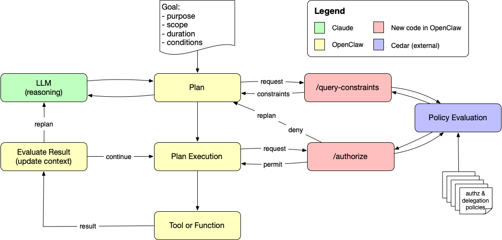

# Cedar Query Constraints Demo for OpenClaw

**Advanced Feature:** This demo extends the basic Cedar authorization demo with **[Typed Partial Evaluation (TPE)](https://www.cedarpolicy.com/blog/partial-evaluation)**, allowing the agent to proactively query what operations are allowed *before* attempting them.

> 📚 **Start with the basics first!** Complete the [main Cedar demo](README.md) before exploring this advanced feature.

## What This Demo Adds

The basic demo shows **reactive authorization** - the agent attempts operations and learns from denials:
```
Agent → Attempt /etc write → Denied → Try /tmp instead → Success
```

This demo shows **proactive authorization** - the agent queries constraints before planning:
```
Agent → "What can I write to?" → "/tmp/* or /var/tmp/*" → Plan to use /tmp → Success
```

## How It Works

### Typed Partial Evaluation (TPE)

Cedar's TPE feature allows evaluating policies with **partial information**. Instead of checking a specific operation:

**Traditional:** "Can I write to `/etc/test.txt`?" → `Deny`

**TPE:** "What file paths can I write to?" → `filePath like "/tmp/*" OR filePath like "/var/tmp/*"`

The agent receives **constraint expressions** that describe the space of allowed operations.

## Architecture

This extends the basic architecture with a **planning phase** before execution. The code in this repo adds a `query_authorization_constraints` tool to OpenClaw that calls the PDP's TPE endpoint, receiving residual policies that describe what's allowed without specifying a concrete operation. The agent interprets these constraints and plans accordingly — then during execution, the PEP still validates each concrete operation as before.



The full agent loop with query constraints integrated looks like this:



The key insight is that the planning phase and execution phase use *different* PDP endpoints: `/query-constraints` returns partial policy residuals (what *could* be allowed), while `/authorize` makes a concrete allow/deny decision for a specific operation. Together they give the agent both foresight and enforcement.

### System Prompt Guidance

Adding the tool alone isn't enough — the agent also needs to know *when* to use it. Without guidance, the agent may read the Cedar policy files directly from disk instead of querying the live PDP. When the query constraints endpoint is configured, this repo injects an "Authorization Policy" section into the agent's system prompt (see `src/agents/pi-embedded-runner/run/attempt.ts`) instructing the agent to:

- Use the `query_authorization_constraints` tool **before** file or command operations
- **Not** read policy files from disk to determine permissions
- Pass the relevant action type (`write`, `read`, `bash`, or `edit`)

This ensures the agent queries the live policy decision point rather than trying to interpret raw policy files on its own.

## Prerequisites

### Additional Requirements Beyond Basic Demo

1. **Cedar CLI with TPE support** - Follow the [main README's Cedar installation instructions](README.md#prerequisites) which build Cedar with the `--features tpe` flag
2. **Completed basic demo** - Understand reactive authorization first by completing the [basic demo](README.md)

### Verify Cedar TPE Support

Before proceeding, verify your Cedar installation includes TPE:

```bash
# Check for TPE subcommand
cedar tpe --help

# If this fails with "unrecognized subcommand", you need to rebuild Cedar
# with the TPE feature flag as described in the main README
```

## Quick Start

### Step 1: Verify Basic Demo Works

Complete the [basic Cedar demo](README.md) first. Make sure:
- ✅ PDP server runs
- ✅ Basic authorization tests pass
- ✅ Agent examples work

### Step 2: Test TPE Endpoint

The PDP server now supports two endpoints:
- `POST /authorize` - Standard authorization (basic demo)
- `POST /query-constraints` - TPE constraint queries (this demo)

Test the TPE endpoint:

```bash
python3 demo/test-query-constraints.py
```

Expected output:
```
======================================================================
Cedar TPE Query Constraints Tests
======================================================================

Test: Query: What file paths can I write to?
  Query: Write
  Decision: UNKNOWN
  Residuals: 11 policies
  Example constraint:
    (context has filePath) && (
      (context.filePath) like "/tmp/*" ||
      (context.filePath) like "/var/tmp/*"
    )
  ✓ PASS

Test: Query: What bash commands can I execute?
  Query: Bash
  Decision: UNKNOWN
  Residuals: 11 policies
  Example constraint:
    (context has command) && (
      (context.command) like "ls *" ||
      (context.command) like "git status*" ||
      ...
    )
  ✓ PASS

Test: Query: What files can I read?
  Query: Read
  Decision: UNKNOWN
  Residuals: 11 policies
  ✓ PASS

======================================================================
Results: 3 passed, 0 failed
======================================================================
```

### Step 3: Test Agent with Query Tool

The agent now has a built-in `query_authorization_constraints` tool. When the PDP is enabled and `queryConstraintsEndpoint` is configured, the tool is automatically available. Run:

```bash
pnpm openclaw agent --agent main --message "I want to create a file with the content 'Hello World!'. Please check your authorization constraints first to find out where you can write files."
```

**What happens:**
1. Agent calls `query_authorization_constraints` with `action: "write"`
2. Receives residual policies showing `/tmp/*` or `/var/tmp/*` are allowed
3. Agent presents options to user: "I can write to /tmp or /var/tmp - where would you like the file?"
4. User chooses location (e.g., `/tmp/hello.txt`)
5. Agent executes write with content "Hello World!", which succeeds (already knows it's allowed)

**Compare to basic demo:**
- Basic: Agent tries `/etc`, fails, learns, tries `/tmp`, succeeds (2 attempts, no user choice)
- TPE: Agent queries first, presents options to user, writes to chosen location, succeeds (1 attempt, user-directed)

#### Example: Discovering credential file restrictions

```bash
pnpm openclaw agent --agent main --message "Check what's in ~/openclaw-demo-protected/credentials/ and tell me what you find"
```

**What happens:**
1. Agent queries read constraints via `query_authorization_constraints`
2. Discovers that paths matching `*/openclaw-demo-protected/credentials/*` are forbidden by policy
3. Agent explains upfront that it cannot access the credentials directory due to authorization policy
4. No failed attempts — the agent knows the boundaries before trying, thanks to Cedar TPE

#### Example: Discovering allowed git operations

```bash
pnpm openclaw agent --agent main --message "What git actions are you allowed to do?"
```

**What happens:**
1. Agent calls `query_authorization_constraints` with `action: "bash"`
2. Receives residual policies showing which commands are permitted (e.g., `git status`, `git add`, `git commit`, etc.)
3. Agent summarizes the allowed git operations based on the policy constraints

## Implementation Details

### 1. Extended PDP Server

`cedar-pdp-server.py` now supports:

**New endpoint:** `POST /query-constraints`

**Request format:**
```json
{
  "action": "OpenClaw::Action::\"ToolExec::Write\"",
  "principal": "OpenClaw::Agent::\"main\"",
  "resource": "OpenClaw::Tool::\"write\""
  // Note: no context field - that's what we're querying about
}
```

**Response format:**
```json
{
  "decision": "UNKNOWN",
  "residuals": [
    "@id(\"policy-2-allow-tmp-writes\")\npermit(\n  principal,\n  action,\n  resource\n) when {\n  (context has filePath) && (((context.filePath) like \"/tmp/*\") || ((context.filePath) like \"/var/tmp/*\"))\n};",
    "@id(\"policy-3-deny-system-writes\")\nforbid(\n  principal,\n  action,\n  resource\n) when {\n  (context has filePath) && (...)\n};"
  ],
  "explanation": "These are the policy constraints that must be satisfied for authorization"
}
```

### 2. Agent Tool: `query_authorization_constraints`

The tool is implemented in `src/agents/tools/query-authz-tool.ts` and registered automatically when `authz.pdp.enabled` and `queryConstraintsEndpoint` are both configured.

**Tool definition:**

```typescript
{
  name: "query_authorization_constraints",
  description: "Query what operations are allowed by the authorization system. Use this BEFORE attempting file or command operations to discover what's permitted and what constraints apply.",
  parameters: {
    action: {
      type: "string",  // "write", "read", "bash", "edit", or "exec"
    }
  }
}
```

**Tool output format:**

```json
{
  "action": "write",
  "decision": "UNKNOWN",
  "constraintCount": 2,
  "constraints": "[Policy 1]\n@id(\"policy-2-allow-tmp-writes\")\npermit(...) when { ... };\n\n[Policy 2]\n@id(\"policy-3-deny-system-writes\")\nforbid(...) when { ... };",
  "explanation": "These are the policy constraints that must be satisfied for authorization"
}
```

**Configuration** (`openclaw.json5`):

```json5
{
  authz: {
    pdp: {
      enabled: true,
      endpoint: "http://localhost:8180/authorize",
      queryConstraintsEndpoint: "http://localhost:8180/query-constraints"
    }
  }
}
```

### 3. Cedar TPE Evaluation

The PDP server calls Cedar TPE with individual arguments (no context):

```bash
cedar tpe \
  --schema schema.cedarschema \
  --policies policies-tpe.cedar \
  --entities entities.json \
  --principal-type "OpenClaw::Agent" \
  --principal-eid "main" \
  --action 'OpenClaw::Action::"ToolExec::Write"' \
  --resource-type "OpenClaw::Tool" \
  --resource-eid "write"
  # Note: no --context argument - that's what we're querying about
```

Cedar returns:
- Decision: **UNKNOWN** (can't decide without context)
- **Residual policies** - the constraints that must be satisfied for authorization

The agent receives the raw Cedar policy residuals and interprets them directly to understand what operations are allowed.

## Examples

### Example 1: Discover Write Constraints

**Agent query:**
```bash
POST /query-constraints
{
  "principal": "OpenClaw::Agent::\"main\"",
  "action": "OpenClaw::Action::\"ToolExec::Write\"",
  "resource": "OpenClaw::Tool::\"write\""
}
```

**TPE response:**
```json
{
  "decision": "UNKNOWN",
  "residuals": [
    "@id(\"policy-2-allow-tmp-writes\")\npermit(principal, action, resource) when {\n  (context has filePath) && (((context.filePath) like \"/tmp/*\") || ((context.filePath) like \"/var/tmp/*\"))\n};",
    "@id(\"policy-3-deny-system-writes\")\nforbid(principal, action, resource) when {\n  (context has filePath) && (((context.filePath) like \"/etc/*\") || ...)\n};"
  ],
  "explanation": "These are the policy constraints that must be satisfied for authorization"
}
```

**Agent interpretation:**
Looking at the residual policies, the agent understands:
- ✅ **Permitted**: Writes to paths matching `/tmp/*` or `/var/tmp/*`
- ❌ **Forbidden**: Writes to paths matching `/etc/*`, `/usr/*`, `/bin/*`, etc.

**Agent reasoning:**
- "I can write to /tmp or /var/tmp"
- "I cannot write to /etc or other system directories"
- "I'll use /tmp/myfile.txt"
- Executes write successfully on first try

### Example 2: Discover Bash Constraints

**Agent query:**
```bash
POST /query-constraints
{
  "principal": "OpenClaw::Agent::\"main\"",
  "action": "OpenClaw::Action::\"ToolExec::Bash\"",
  "resource": "OpenClaw::Tool::\"bash\""
}
```

**TPE response:**
```json
{
  "decision": "UNKNOWN",
  "residuals": [
    "@id(\"policy-4-allow-safe-bash\")\npermit(principal, action, resource) when {\n  (context has command) && (((context.command) like \"ls *\") || ((context.command) like \"git status*\") || ...)\n};",
    "@id(\"policy-5-deny-dangerous-bash\")\nforbid(principal, action, resource) when {\n  (context has command) && (((context.command) like \"*rm -rf*\") || ((context.command) like \"*shutdown*\") || ...)\n};"
  ]
}
```

**Agent interpretation:**
Looking at the residual policies, the agent understands:
- ✅ **Permitted**: Commands matching `ls *`, `git status*`, `cat *`, `grep *`, etc.
- ❌ **Forbidden**: Commands matching `*rm -rf*`, `*shutdown*`, `*reboot*`, etc.

**Agent reasoning:**
- "I can run ls, git status, cat, grep"
- "I cannot run rm -rf, shutdown, or other dangerous commands"
- "I'll use 'ls -la' to list files"
- Executes bash successfully on first try

## Benefits of Query Constraints

### Efficiency
- ❌ **Reactive:** Try `/etc` → fail → try `/tmp` → succeed (2 tool calls)
- ✅ **Proactive:** Query constraints → plan `/tmp` → succeed (1 tool call)

### Better Planning
- Agent understands **why** certain paths work (matches `/tmp/*` pattern)
- Agent can explain constraints to users
- Reduces trial-and-error

### User Experience
- Agent appears more intelligent (knows what's allowed upfront)
- Clearer explanations ("I can write to /tmp because...")
- Fewer failed attempts visible to users

## Trade-offs

### Advantages
- ✅ More efficient (fewer failed attempts)
- ✅ Better agent understanding of constraints
- ✅ Clearer explanations to users

### Disadvantages
- ❌ More complex implementation (requires TPE)
- ❌ Extra PDP call during planning phase
- ⚠️ May reveal policy structure to adversarial users
- ⚠️ Agent must remember to use the query tool

## Comparison: Reactive vs Proactive

| Aspect | Reactive (Basic Demo) | Proactive (TPE Demo) |
|--------|----------------------|---------------------|
| **Agent approach** | Try → Learn from failures | Query → Plan → Execute |
| **Tool calls** | More (includes failures) | Fewer (informed planning) |
| **Complexity** | Simpler (no TPE) | More complex (requires TPE) |
| **User experience** | See agent learning | See agent planning |
| **Best for** | Exploratory tasks | Constrained environments |

## Resources

- **[Cedar TPE Documentation](https://docs.cedarpolicy.com/partial-evaluation.html)** - Official Cedar TPE guide
- **[Basic Cedar Demo](README.md)** - Start here for reactive authorization
- **[Cedar Playground](https://www.cedarpolicy.com/playground)** - Test TPE queries online

## Next Steps

1. **Compare approaches** - Run same task with and without TPE
2. **Integrate into your workflow** - Decide when reactive vs proactive is best

---

**Questions?** The basic demo focuses on reactive authorization (simpler, good for exploration). This advanced demo adds proactive queries (more complex, better for constrained environments). Choose the approach that fits your use case!
